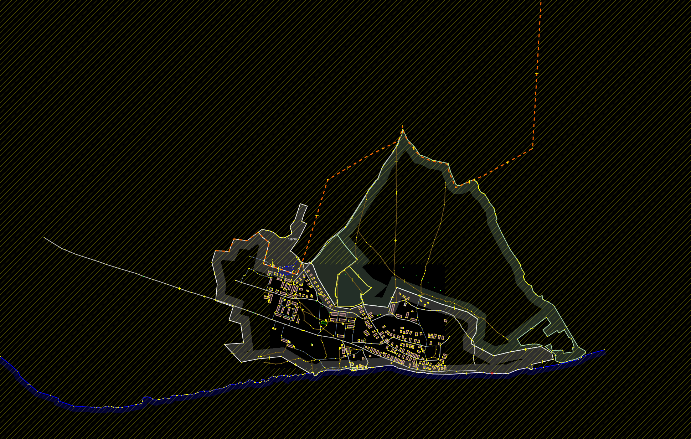
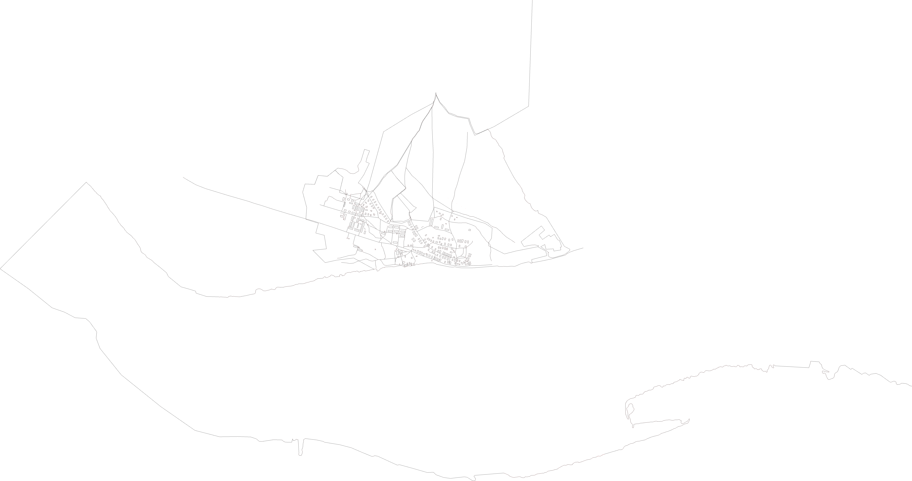

# osm2png
*Convert from osm file to image*

# SixLabors.ImageSharp - for image creation
```
dotnet add package SixLabors.ImageSharp
```

# Run
```
dotnet run ../example/map.osm ../example/map_output.png 1
```

# Result



